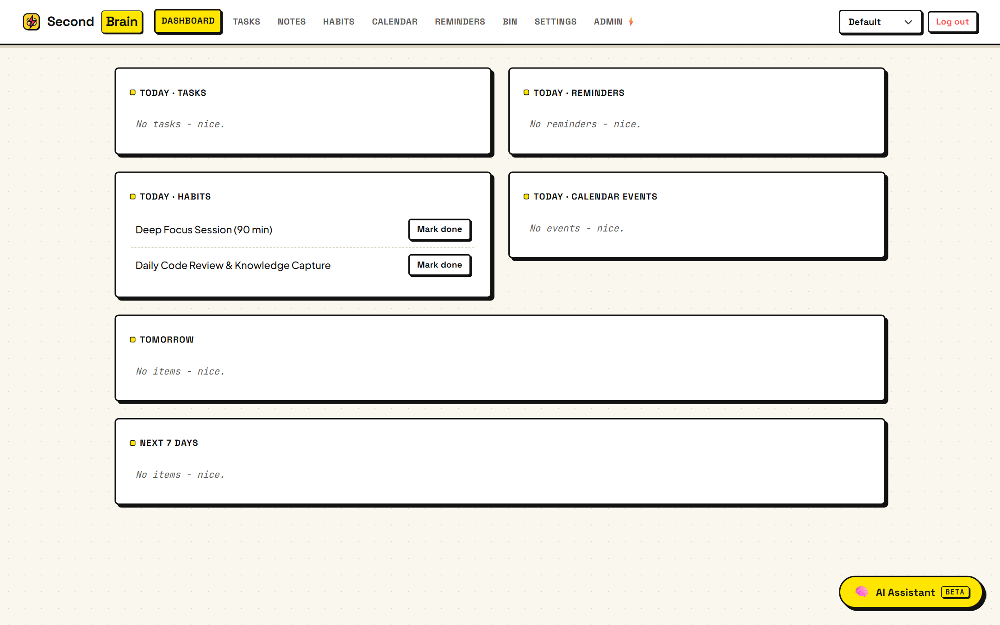
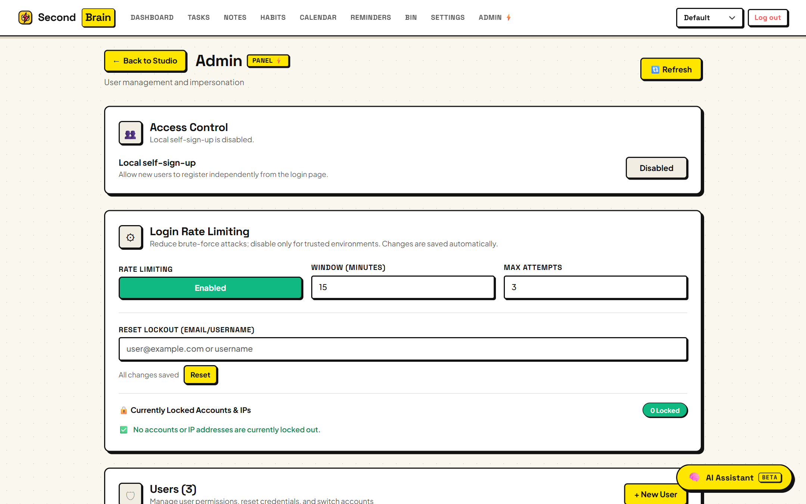
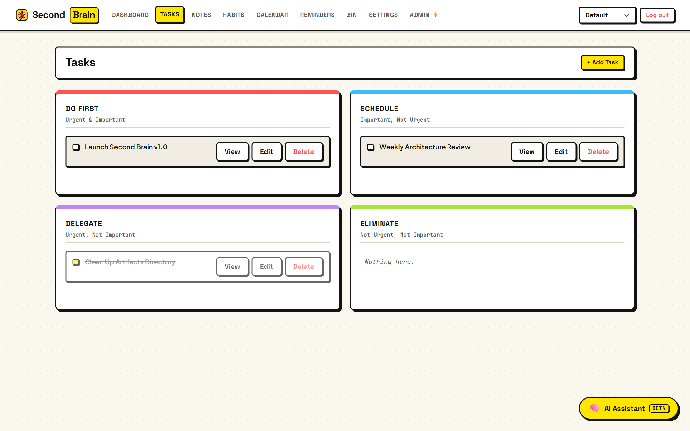
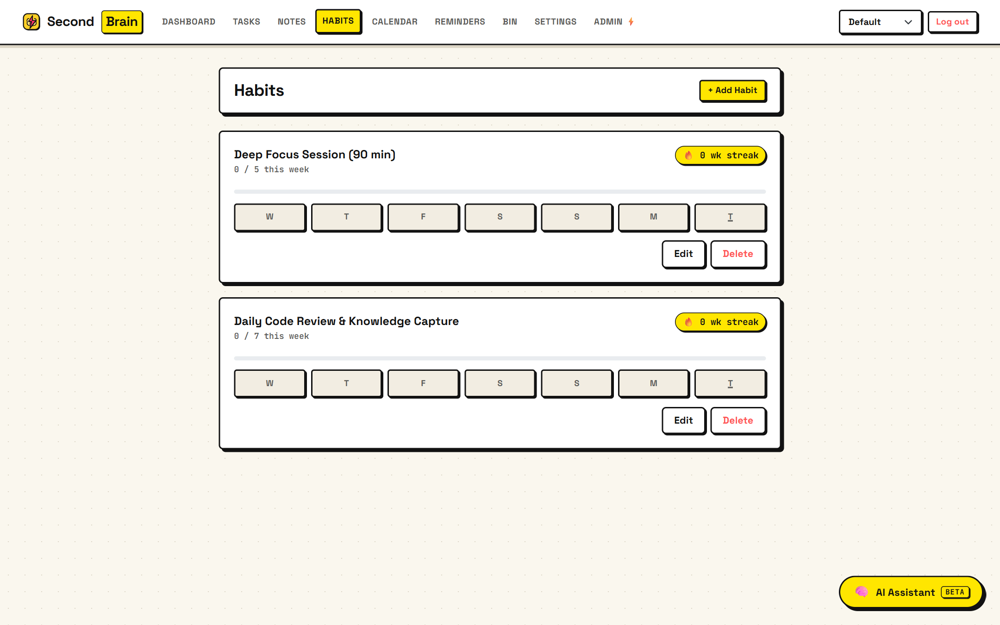
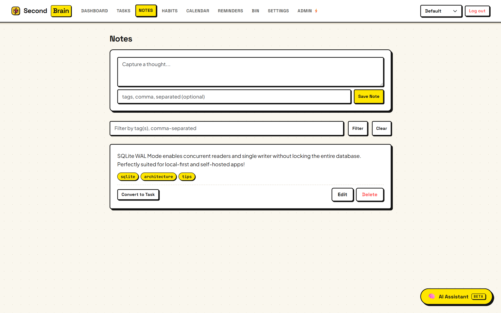
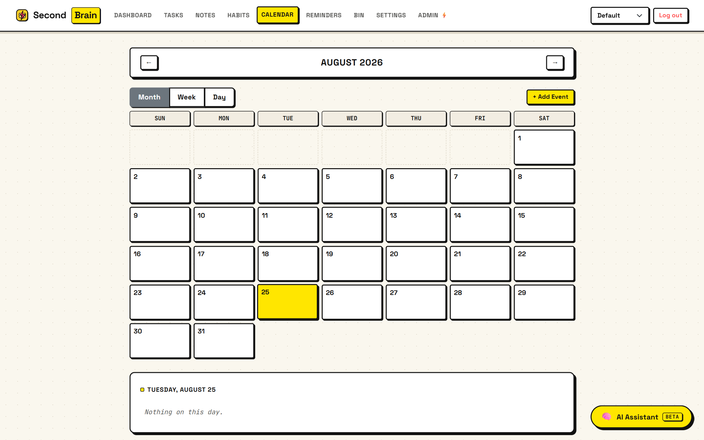
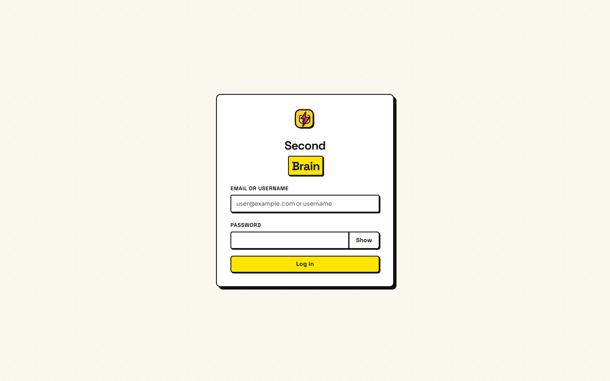

# Second Brain 🧠⚡

A personal knowledge, task, habit, and schedule management platform built with a bold **Neo-Brutalism** aesthetic. Second Brain combines note capture, Eisenhower prioritization, habit tracking with weekly streak mathematics, a unified calendar, proactive reminders, soft-delete recovery, and a **Super Admin Security & Access Control Panel** with sliding-window brute-force defense.

Supports both **zero-config local SQLite (with WAL mode)** and **Supabase (PostgreSQL)**.

---

## 📸 Application Showcase

### 📊 1. Command Center Dashboard
*Unified daily agenda combining overdue tasks, today's Eisenhower matrix, habit streaks, reminders, and upcoming 7-day forecast.*


---

### 👑 2. Super Admin & Access Control Panel
*Manage user roles, toggle global self-signup, configure dynamic rate limiting, force password resets, deactivate accounts, and inspect active lockouts in real time.*


---

### 🎯 3. Eisenhower Matrix & Task Management
*Prioritize tasks across 4 quadrants (Do First, Schedule, Delegate, Eliminate) with due dates, tags, and status tracking.*


---

### 🔥 4. Habit Tracking & Streak Engine
*Weekly-quota habits with live streak calculation computed directly from habit completion logs (capped at 52 weeks).*


---

### 📝 5. Quick Notes & Instant Task Conversion
*Capture quick thoughts with tags, search effortlessly, and convert any note directly into an actionable task.*


---

### 📅 6. Unified Calendar & Schedule
*Day, week, and month views aggregating scheduled tasks, habit checks, and standalone calendar events with DST-safe timezone handling.*


---

### 🔐 7. Authentication & Setup
*First-run Super Admin bootstrap screen, token rotation, and sliding-window brute-force lockout protection.*


---

## ✨ Core Features

| Domain | Highlights |
|---|---|
| **👑 Super Admin & Security** | First-run setup initialization, global access control toggles (disable public signup), sliding-window rate limiting with automatic lockout countdowns & 1-click admin unlocking, user deactivation, and mandatory password reset lockdown. |
| **👥 Multi-Profile Isolation** | Netflix-style profile switching (up to 5 isolated profiles per user account). All content is strictly isolated per profile. |
| **🎯 Tasks (Eisenhower Matrix)** | 4-quadrant prioritization (*Urgent & Important*, *Important / Not Urgent*, *Urgent / Not Important*, *Neither*), due dates, and completion status. |
| **📝 Notes & Auto-Conversion** | Fast taggable markdown-ready notes with 1-click conversion into tasks with back-linking. |
| **🔥 Habits & Streaks** | Weekly quota model (e.g. 5x/week or daily) with streak algorithms resilient to DST and timezone offsets. |
| **📅 Unified Calendar** | Aggregated view of tasks with deadlines, habit check logs, and standalone events in your local timezone. |
| **⏰ Automated Background Crons** | Built-in cron jobs for per-minute reminder notifications and 30-day automated recycle bin purges. |
| **🎨 Neo-Brutalism Design** | Solid borders, hard drop shadows, tactile button mechanics, and high-contrast typography. |
| **💾 Dual Database Engine** | Native **SQLite (WAL mode)** for offline/self-hosted deployment, or **Supabase (PostgreSQL)** for cloud scalability. |

---

## 🚀 Quick Start: Running with Docker (Recommended)

Run the entire full-stack application (Nginx frontend + Node.js API + persistent SQLite database) with a single command:

```bash
docker compose up --build -d
```

- **Web Application:** [http://localhost:5500](http://localhost:5500)
- **REST API Backend:** [http://localhost:4000](http://localhost:4000)
- **Data Persistence:** Saved in `./db/second_brain.sqlite`

To stop containers:
```bash
docker compose down
```

---

## 💻 Local Development Setup (Without Docker)

### Prerequisites
- **Node.js 20+** or **Node.js 22 LTS** ([Download Node.js](https://nodejs.org/))

### 1. Install Dependencies
```bash
npm install
```

### 2. Configure Environment Variables
Copy the example environment file:
```bash
# Windows (PowerShell)
Copy-Item .env.example .env

# macOS / Linux
cp .env.example .env
```

### 3. Start the Backend API
```bash
npm run dev
```
*The API will start on **`http://localhost:4000`** (Health check: `http://localhost:4000/health`).*

### 4. Serve the Frontend
In a second terminal window:
```bash
npx serve frontend -l 5500
```
Navigate to **`http://localhost:5500`** in your browser. On the first launch, you will be prompted to create the Super Admin account!

---

## 🗄️ Database Engine Options

Second Brain supports two database modes configured via `DB_CLIENT` in your `.env`:

### Option A: SQLite (Default & Zero Setup)
```ini
DB_CLIENT=sqlite
SQLITE_DB_PATH=./db/second_brain.sqlite
```
- Automatically initializes all tables, indexes, and settings on startup.
- WAL (Write-Ahead Logging) mode enabled for high-concurrency reading and writing.

### Option B: Supabase (PostgreSQL)
```ini
DB_CLIENT=supabase
SUPABASE_URL=https://your-project-id.supabase.co
SUPABASE_SERVICE_ROLE_KEY=your-service-role-secret-key
```
1. Paste [`db/schema.sql`](db/schema.sql) into your [Supabase SQL Editor](https://supabase.com/dashboard) and run.
2. Update `.env` with your Supabase credentials.

---

## ⚙️ Environment Variables Reference

| Variable | Default | Description |
|---|---|---|
| `PORT` | `4000` | Port the Express API server listens on |
| `NODE_ENV` | `development` | `development` or `production` |
| `DB_CLIENT` | `sqlite` | Database engine (`sqlite` or `supabase`) |
| `SQLITE_DB_PATH` | `./db/second_brain.sqlite` | SQLite database file location |
| `SUPABASE_URL` | - | Supabase project URL (required if `DB_CLIENT=supabase`) |
| `SUPABASE_SERVICE_ROLE_KEY` | - | Supabase service role key (required if `DB_CLIENT=supabase`) |
| `JWT_ACCESS_SECRET` | *(random string)* | 64+ character secret for signing access tokens |
| `JWT_ACCESS_EXPIRES_IN` | `15m` | Access token lifespan (e.g. `15m`, `1h`) |
| `JWT_REFRESH_EXPIRES_IN_DAYS` | `30` | Refresh token lifespan in days |
| `CORS_ORIGIN` | `http://localhost:5500` | Comma-separated list of allowed frontend origins |

---

## 📁 Project Structure

```
├── db/
│   ├── schema.sql              # Supabase PostgreSQL DDL & migrations
│   ├── schema-erd.mmd          # Mermaid Entity-Relationship diagram
│   └── second_brain.sqlite     # SQLite database (when DB_CLIENT=sqlite)
├── docs/
│   └── screenshots/            # High-resolution UI screenshots for documentation
├── src/
│   ├── config/                 # Database initialization (db.js) and env validation (env.js)
│   ├── controllers/            # Request handlers (auth, admin, tasks, notes, habits, etc.)
│   ├── middleware/             # requireAuth, requireAdmin, and sliding-window rate limiters
│   ├── routes/                 # Express route definitions
│   ├── services/               # Database queries, business logic, and lockout trackers
│   ├── utils/                  # JWT token signing, password hashing, and timezone arithmetic
│   └── server.js               # Express application and background cron schedulers
├── frontend/
│   ├── assets/                 # Vector SVG favicons and branding logos
│   ├── css/                    # Neo-Brutalist design system & responsive layout (app.css)
│   ├── js/                     # API client, auth flow, layout navbar, and page scripts
│   ├── pages/                  # dashboard, admin, tasks, notes, habits, calendar, bin, settings
│   ├── index.html              # Super Admin bootstrap & login portal
│   ├── Dockerfile              # Nginx production frontend container
│   └── nginx.conf              # Nginx reverse proxy configuration
├── Dockerfile                  # Node.js 22 Bookworm backend container
├── docker-compose.yml          # Full-stack Docker orchestration
├── package.json
└── README.md
```

---

## 🧪 Testing Suite

Second Brain includes regression and stress test suites running in-memory without requiring external services:

```bash
# Run timezone, streak math, and controller stress tests
node tests/stress-time.js
node tests/stress-habits.js
node tests/stress-controllers.js
node tests/frontend-dst.js
```

---

## 📖 API Documentation

For the complete REST API specification, headers, request payloads, and schema schemas, refer to [**`api.md`**](api.md).
